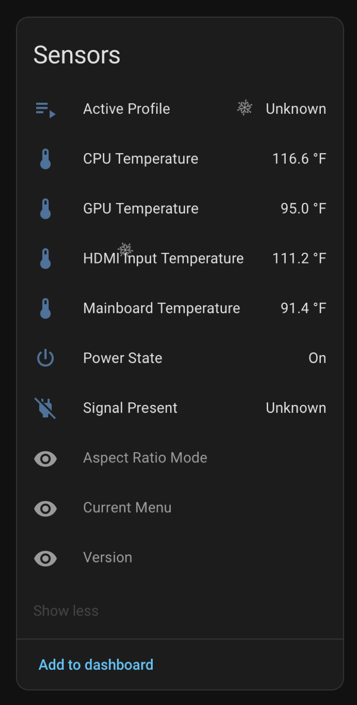
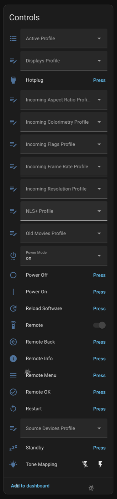

# madVR Envy Home Assistant Integration

Home Assistant custom integration for madVR Envy video processors, powered by [`madvr-envy`](https://github.com/binarylogic/py-madvr-envy).

## Source of Truth and Core Sync

This repository is the canonical implementation for the HACS integration.

When syncing to Home Assistant Core (`madvr` domain), we keep a compatibility layer so existing users are not broken by entity/service contract changes.

Sync and compatibility details: [`SYNC_NOTES.md`](SYNC_NOTES.md)

## Prerequisites

1. Home Assistant with [HACS](https://hacs.xyz) installed
2. madVR Envy reachable from Home Assistant on your network
3. Envy API port available (default `44077`)

## Installation

### Via HACS (Recommended)

1. Open HACS in Home Assistant.
2. Go to `Integrations`.
3. Click the top-right menu (three dots) and select `Custom repositories`.
4. Paste this repository URL:
   - `https://github.com/binarylogic/madvr-envy-homeassistant`
5. Set category to `Integration`.
6. Click `Add`.
7. Search for `madVR Envy` in HACS Integrations.
8. Open it and click `Download`.
9. Restart Home Assistant.
10. Go to Settings > Devices & Services > `Add Integration`.
11. Search for `madVR Envy` and complete setup.

### Manual

1. Copy `custom_components/madvr_envy` into your Home Assistant `config/custom_components/`.
2. Restart Home Assistant.
3. Go to Settings > Devices & Services > `Add Integration`.
4. Search for `madVR Envy` and complete setup.

## Configuration

1. Go to Settings > Devices & Services.
2. Click `Add Integration`.
3. Search for `madVR Envy`.
4. Enter host and port (default `44077`).

## Quick Start (5 Minutes)

If you just want to get working quickly:

1. Add the integration with your Envy host/IP and port.
2. Add these entities to a dashboard:
   - `remote.madvr_envy_*`
   - `sensor.*_power_state`
   - `switch.*_tone_map`
   - `select.*_power_mode`
   - `select.*_active_profile`
3. Verify `sensor.*_power_state` updates correctly when the Envy power mode changes.
4. Use `remote.turn_on` / `remote.turn_off` from Home Assistant to confirm command path works.

## How You Actually Use It

Common day-to-day patterns:

1. Use the `select` entities for deterministic automation state:
   - `select.*_power_mode`
   - `select.*_active_profile`
2. Use `switch.*_tone_map` for quick enable/disable in scenes.
3. Use `remote.send_command` for remote buttons and direct actions.
4. Use integration services when you want explicit, script-friendly control.

Example: startup scene with profile selection

```yaml
automation:
  - alias: "Movie Night - Envy"
    trigger:
      - platform: state
        entity_id: input_boolean.movie_night
        to: "on"
    action:
      - service: remote.turn_on
        target:
          entity_id: remote.madvr_envy_*
      - delay: "00:00:02"
      - service: select.select_option
        target:
          entity_id: select.madvr_envy_*_active_profile
        data:
          option: "Cinema: Day"
      - service: switch.turn_on
        target:
          entity_id: switch.madvr_envy_*_tone_map
```

Example: remote action command

```yaml
service: remote.send_command
target:
  entity_id: remote.madvr_envy_*
data:
  command:
    - MENU
    - INFO
    - action:restart
```

## Services

- `madvr_envy.press_key`
  - `key` (for example `MENU`, `INFO`, `OK`, `BACK`, `LEFT`, `RIGHT`, `UP`, `DOWN`)
- `madvr_envy.activate_profile`
  - `group_id`, `profile_index`
- `madvr_envy.run_action`
  - `action`: `standby`, `power_off`, `hotplug`, `restart`, `reload_software`, `tone_map_on`, `tone_map_off`

## Exposed Entities

- Sensors: power state, temperatures, version
- Sensors: incoming/outgoing signal resolution, frame rate, HDR mode, incoming aspect ratio
- Sensors: aspect ratio mode, aspect ratio name/decimal, masking ratio decimal, active profile
- Sensors (advanced): version, current menu
- Binary sensor: signal present
- Switch: tone mapping
- Select: power mode, active profile, per-profile-group selects
- Buttons: power, standby, hotplug, restart, reload software, remote buttons
- Remote: keypress and action commands (`action:standby`, `action:restart`, etc.)

## Exposed Events

Adapter events are forwarded to the HA event bus as `madvr_envy.<event_kind>`, including:

- `madvr_envy.initial`
- `madvr_envy.system_action`
- `madvr_envy.display_changed`
- `madvr_envy.settings_uploaded`
- `madvr_envy.button`
- `madvr_envy.option_inherited`

## Troubleshooting

1. Setup says `Failed to connect to the madVR Envy`:
   - Confirm host/IP and port (`44077` by default).
   - Confirm Home Assistant can reach the Envy over the network.
2. Integration loads but commands do not execute:
   - Check entity availability and `sensor.*_power_state` first.
   - Verify the Envy is not in a state that rejects command execution.
3. Some entities are missing:
   - Check integration options and ensure `Enable advanced entities` is on.

## Development

```bash
make install
make lint
make test
```

`make install` behavior:

- If `../py-madvr-envy` exists, it installs editable local library.
- Otherwise it installs `madvr-envy` from GitHub.

## Release Process

- Conventional commits on `main`
- `release-please` opens/updates release PRs automatically
- Merging release PR creates GitHub release and uploads `madvr_envy.zip`

## Screenshots

### Sensors



### Controls


